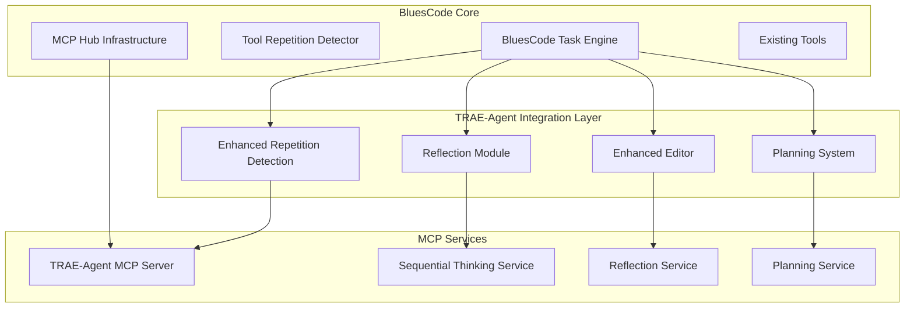
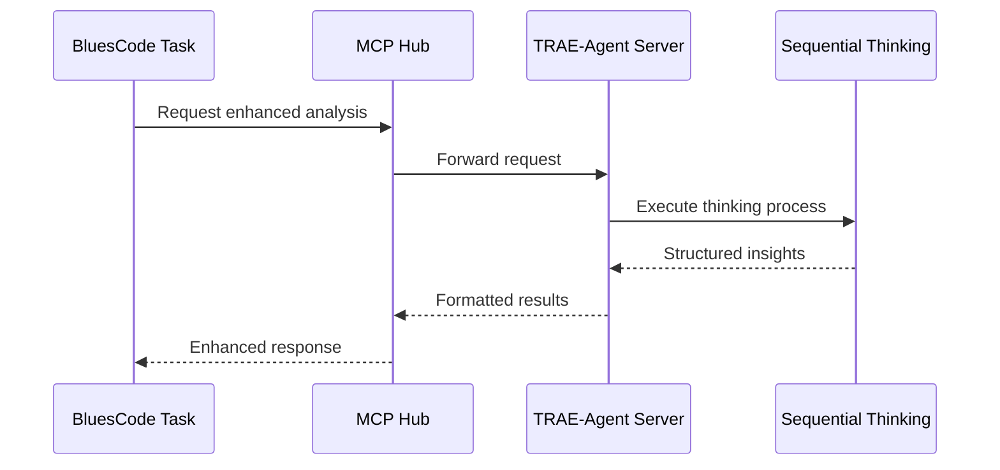

# TRAE-Agent Integration Plan for BluesCode

## Executive Summary

This document outlines the comprehensive integration plan for implementing prioritized TRAE-Agent tools into the BluesCode codebase. The integration follows a phased approach focusing on four key components: Enhanced Repetition Detection, Reflection Module, Planning System, and Enhanced Editor capabilities.

## Architecture Overview



## Phase 1: Enhanced Repetition Detection System

### Current State Analysis

- **Existing**: `ToolRepetitionDetector.ts` (105 lines)
- **Limitations**: Basic threshold counting, no pattern analysis
- **Integration Point**: `src/core/tools/ToolRepetitionDetector.ts`

### Enhanced Architecture Design

```typescript
// New Enhanced Repetition Detection System
interface RepetitionPattern {
	type: "exact_match" | "semantic_similarity" | "cyclic_behavior" | "escalating_failure"
	confidence: number
	context: ToolExecutionContext[]
	suggestedIntervention: InterventionStrategy
}

interface InterventionStrategy {
	type: "pause_and_reflect" | "suggest_alternative" | "request_guidance" | "escalate_to_planning"
	reasoning: string
	alternativeApproaches?: string[]
}

class EnhancedRepetitionDetector extends ToolRepetitionDetector {
	private patternAnalyzer: PatternAnalyzer
	private contextWindow: ToolExecutionContext[] = []
	private reflectionModule: ReflectionModule

	public analyzeExecution(context: ToolExecutionContext): RepetitionAnalysis {
		// Multi-dimensional analysis
		const patterns = this.detectPatterns(context)
		const semanticSimilarity = this.analyzeSemantic(context)
		const contextualRelevance = this.assessContext(context)

		return this.synthesizeAnalysis(patterns, semanticSimilarity, contextualRelevance)
	}
}
```

### File Structure

```
src/core/tools/enhanced-repetition/
├── EnhancedRepetitionDetector.ts
├── PatternAnalyzer.ts
├── SemanticAnalyzer.ts
├── InterventionStrategies.ts
└── __tests__/
    ├── pattern-detection.test.ts
    └── intervention-strategies.test.ts
```

## Phase 2: Reflection Module Integration

### Architecture Design

The Reflection Module will be implemented as a hybrid system combining direct integration with MCP service capabilities:

```typescript
interface ReflectionContext {
	taskHistory: AgentStep[]
	currentObjective: string
	previousAttempts: ToolResult[]
	environmentState: EnvironmentSnapshot
}

interface ReflectionInsight {
	assessment: SelfAssessment
	identifiedIssues: Issue[]
	recommendedActions: Action[]
	confidenceLevel: number
}

class ReflectionModule {
	private sequentialThinking: SequentialThinkingTool
	private mcpClient: MCPClient

	public async performReflection(context: ReflectionContext): Promise<ReflectionInsight> {
		// Use TRAE-Agent's sequential thinking for structured reflection
		const thinkingProcess = await this.sequentialThinking.execute({
			thought: `Analyzing current task progress: ${context.currentObjective}`,
			thought_number: 1,
			total_thoughts: 5,
			next_thought_needed: true,
		})

		return this.synthesizeInsights(thinkingProcess, context)
	}
}
```

### Integration Points

- **Primary**: `src/core/task/Task.ts` - Hook into task execution lifecycle
- **Secondary**: `src/core/tools/` - Individual tool reflection capabilities
- **MCP Service**: New TRAE-Agent MCP server for advanced reasoning

### File Structure

```
src/core/reflection/
├── ReflectionModule.ts
├── SelfAssessment.ts
├── InsightSynthesizer.ts
├── ReflectionTriggers.ts
└── mcp-integration/
    ├── ReflectionMCPClient.ts
    └── SequentialThinkingProxy.ts
```

## Phase 3: Planning System Integration

### Architecture Design

```typescript
interface PlanningRequest {
	objective: string
	constraints: Constraint[]
	availableTools: ToolDefinition[]
	context: TaskContext
}

interface ExecutionPlan {
	steps: PlanStep[]
	contingencies: ContingencyPlan[]
	successCriteria: SuccessCriteria[]
	estimatedComplexity: ComplexityMetrics
}

class PlanningSystem {
	private traeAgent: TraeAgent
	private toolAnalyzer: ToolCapabilityAnalyzer

	public async createExecutionPlan(request: PlanningRequest): Promise<ExecutionPlan> {
		// Leverage TRAE-Agent's planning capabilities
		const agentPlan = await this.traeAgent.planTask({
			task: request.objective,
			extra_args: {
				available_tools: request.availableTools,
				constraints: request.constraints,
			},
		})

		return this.adaptToBluesCodeExecution(agentPlan)
	}
}
```

### Integration Strategy

- **Hook Point**: Task initialization in `Task.ts`
- **Planning Triggers**: Complex tasks, failed attempts, user requests
- **Tool Integration**: Enhance existing tools with planning metadata

### File Structure

```
src/core/planning/
├── PlanningSystem.ts
├── PlanExecutor.ts
├── ContingencyHandler.ts
├── ComplexityAnalyzer.ts
└── trae-integration/
    ├── TraeAgentProxy.ts
    └── PlanAdapter.ts
```

## Phase 4: Enhanced Editor Integration

### Architecture Design

Building upon the existing `editFileTool.ts` and TRAE-Agent's `TextEditorTool`:

```typescript
class EnhancedEditingSystem {
	private traeEditor: TextEditorTool
	private bluesCodeDiff: DiffViewProvider
	private validationEngine: EditValidationEngine

	public async performEnhancedEdit(request: EditRequest): Promise<EditResult> {
		// Pre-edit analysis
		const editPlan = await this.analyzeEditRequirements(request)

		// Use TRAE-Agent's sophisticated str_replace
		const traeResult = await this.traeEditor.execute({
			command: "str_replace",
			path: request.filePath,
			old_str: editPlan.targetContent,
			new_str: editPlan.replacementContent,
		})

		// Apply BluesCode's validation and diff viewing
		return this.integrateWithBluesCodeWorkflow(traeResult, request)
	}
}
```

### Integration Points

- **Enhance**: `src/core/tools/editFileTool.ts`
- **Extend**: Diff strategies in `src/core/diff/strategies/`
- **Integrate**: MCP-based editing services

## MCP Service Architecture

### TRAE-Agent MCP Server Design

```typescript
// New MCP Server: trae-agent-mcp-server
class TraeAgentMCPServer {
	private tools = ["sequential_thinking", "enhanced_str_replace", "reflection_analysis", "planning_generation"]

	private resources = ["agent_state", "execution_history", "reflection_insights"]

	public async handleToolCall(name: string, args: any): Promise<ToolResult> {
		switch (name) {
			case "sequential_thinking":
				return this.handleSequentialThinking(args)
			case "enhanced_str_replace":
				return this.handleEnhancedEdit(args)
			// ... other tools
		}
	}
}
```

### MCP Integration Flow



## Data Flow Interfaces

### Core Interface Definitions

```typescript
// Primary integration interfaces
interface TraeAgentIntegration {
	repetitionDetection: EnhancedRepetitionDetector
	reflection: ReflectionModule
	planning: PlanningSystem
	editing: EnhancedEditingSystem
}

interface TaskEnhancementContext {
	originalTask: Task
	traeCapabilities: TraeAgentIntegration
	mcpConnections: MCPConnection[]
}

// Data flow between components
interface ComponentDataFlow {
	input: TaskExecutionContext
	processing: TraeAgentAnalysis
	output: EnhancedTaskResult
	feedback: ReflectionInsights
}
```

## Implementation Timeline

### Phase 1: Foundation (Weeks 1-2)

- [ ] Set up TRAE-Agent MCP server infrastructure
- [ ] Implement basic Enhanced Repetition Detection
- [ ] Create integration test framework
- [ ] Establish data flow interfaces

### Phase 2: Core Integration (Weeks 3-4)

- [ ] Integrate Reflection Module with sequential thinking
- [ ] Enhance existing ToolRepetitionDetector
- [ ] Implement MCP communication layer
- [ ] Create validation and testing suites

### Phase 3: Planning System (Weeks 5-6)

- [ ] Integrate TRAE-Agent planning capabilities
- [ ] Enhance Task.ts with planning hooks
- [ ] Implement contingency handling
- [ ] Create planning UI components

### Phase 4: Enhanced Editing (Weeks 7-8)

- [ ] Integrate advanced str_replace capabilities
- [ ] Enhance diff viewing with TRAE insights
- [ ] Implement edit validation engine
- [ ] Create comprehensive editing tests

### Phase 5: Integration & Testing (Weeks 9-10)

- [ ] End-to-end integration testing
- [ ] Performance optimization
- [ ] Documentation completion
- [ ] User acceptance testing

## Risk Assessment & Mitigation

### High-Risk Areas

1. **MCP Communication Complexity**

    - Risk: Latency and reliability issues
    - Mitigation: Implement robust error handling and fallback mechanisms

2. **Integration Complexity**

    - Risk: Breaking existing BluesCode functionality
    - Mitigation: Comprehensive testing and gradual rollout

3. **Performance Impact**
    - Risk: TRAE-Agent processing overhead
    - Mitigation: Asynchronous processing and caching strategies

### Medium-Risk Areas

1. **Data Synchronization**

    - Risk: State inconsistencies between systems
    - Mitigation: Clear data ownership and synchronization protocols

2. **User Experience Changes**
    - Risk: Disruption to existing workflows
    - Mitigation: Backward compatibility and feature flags

## Testing Strategy

### Unit Testing

- Individual component testing for each TRAE-Agent integration
- Mock MCP services for isolated testing
- Performance benchmarking for each enhancement

### Integration Testing

- End-to-end workflow testing
- MCP communication reliability testing
- Cross-component interaction validation

### User Acceptance Testing

- Beta testing with existing BluesCode users
- Performance impact assessment
- Feature effectiveness evaluation

## Success Metrics

### Technical Metrics

- Reduction in tool repetition incidents (target: 40% reduction)
- Improved task completion rates (target: 25% improvement)
- Enhanced edit accuracy (target: 30% fewer edit failures)

### User Experience Metrics

- User satisfaction with enhanced capabilities
- Adoption rate of new features
- Reduction in user-reported issues

## Conclusion

This integration plan provides a comprehensive roadmap for implementing TRAE-Agent capabilities into BluesCode. The phased approach ensures minimal disruption while maximizing the benefits of enhanced AI agent capabilities. The modular architecture allows for incremental delivery and validation at each stage.

The integration leverages BluesCode's existing MCP infrastructure while introducing sophisticated reasoning, planning, and editing capabilities from TRAE-Agent. This hybrid approach maintains BluesCode's reliability while significantly enhancing its AI agent capabilities.
