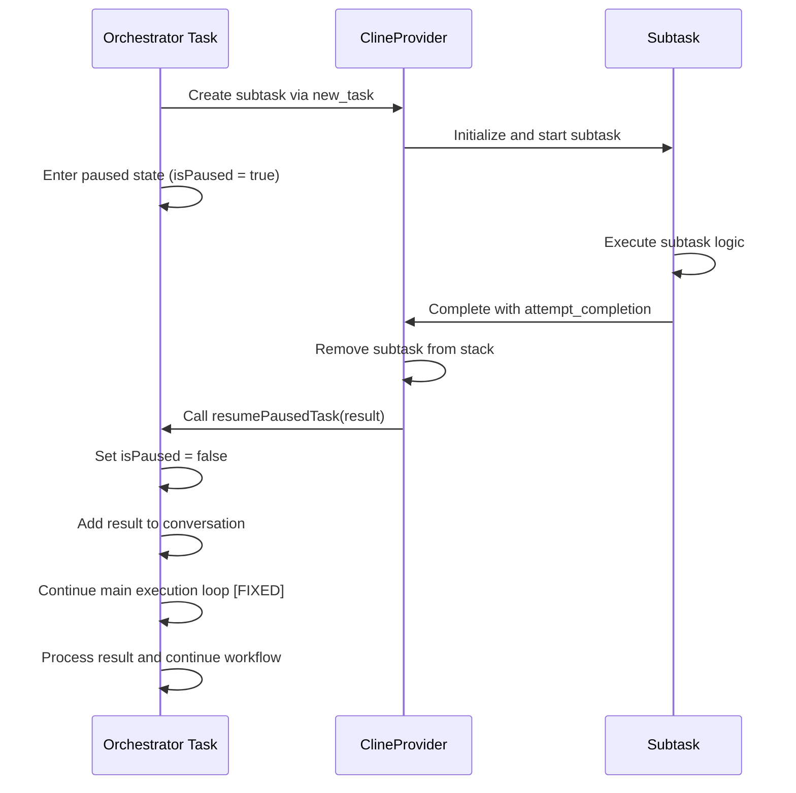

# Orchestrator Workflow Management Fix Documentation

## Overview

This document provides comprehensive documentation for a critical fix to the orchestrator workflow management system in Roo Code. The fix resolves an issue where parent orchestrator tasks would not regain control after subtask completion, causing workflows to hang indefinitely.

## Problem Description

### Issue Summary

When orchestrator mode created subtasks using the `new_task` tool, the parent orchestrator task would pause and wait for the subtask to complete. However, after the subtask finished, the parent task would resume from pause but fail to continue its main execution loop, leaving the workflow in a hanging state.

### Root Cause Analysis

The root cause was identified in the [`Task.resumePausedTask()`](src/core/task/Task.ts:1217-1259) method. The method performed the following steps:

1. ✅ Released the task from paused state (`this.isPaused = false`)
2. ✅ Added subtask result to conversation history
3. ❌ **MISSING**: Failed to explicitly continue the main execution loop

The critical issue was that after setting `isPaused = false`, the method did not trigger the continuation of the main task execution loop with the subtask result as the next user content.

### Symptoms

- Parent orchestrator tasks would appear to resume but remain idle
- Workflows would hang after subtask completion
- No error messages or clear indication of the problem
- Manual intervention required to restart workflows

## Solution Implementation

### Primary Fix Location

**File**: [`src/core/task/Task.ts`](src/core/task/Task.ts:1217-1259)  
**Method**: `resumePausedTask()`  
**Lines**: 1217-1259

### Fix Details

The solution involved modifying the `resumePausedTask()` method to explicitly continue the main execution loop after resuming from pause:

```typescript
public async resumePausedTask(lastMessage: string) {
    console.log(`[DEBUG] Task ${this.taskId}.${this.instanceId} resuming from pause with message: ${lastMessage}`)

    // Release this Cline instance from paused state.
    this.isPaused = false
    this.emit(BluesCodeEventName.TaskUnpaused)

    console.log(`[DEBUG] Task ${this.taskId}.${this.instanceId} unpaused, continuing execution`)

    // Fake an answer from the subtask that it has completed running and
    // this is the result of what it has done  add the message to the chat
    // history and to the webview ui.
    try {
        await this.say("subtask_result", lastMessage)

        await this.addToApiConversationHistory({
            role: "user",
            content: [{ type: "text", text: `[new_task completed] Result: ${lastMessage}` }],
        })

        console.log(`[DEBUG] Task ${this.taskId}.${this.instanceId} added subtask result to conversation, triggering main loop continuation`)

        // CRITICAL FIX: Explicitly continue the main execution loop
        // The main loop is waiting in waitForResume(), but after we set isPaused = false,
        // we need to ensure the loop continues with the subtask result as the next user content
        const nextUserContent = [{
            type: "text" as const,
            text: `[new_task completed] Result: ${lastMessage}`
        }]

        // Continue the recursive execution loop with the subtask result
        console.log(`[DEBUG] Task ${this.taskId}.${this.instanceId} calling recursivelyMakeClineRequests to continue execution`)
        await this.recursivelyMakeClineRequests(nextUserContent, false)

    } catch (error) {
        console.error(`[DEBUG] Task ${this.taskId}.${this.instanceId} failed to resume:`, error)
        this.providerRef
            .deref()
            ?.log(`Error failed to add reply from subtask into conversation of parent task, error: ${error}`)

        throw error
    }
}
```

### Key Changes Made

1. **Added explicit loop continuation**: After setting `isPaused = false`, the method now calls `recursivelyMakeClineRequests()` with the subtask result as user content.

2. **Enhanced debugging**: Added comprehensive debug logging to track the resume process.

3. **Proper error handling**: Maintained existing error handling while ensuring the fix doesn't introduce new failure points.

### Supporting Changes

**File**: [`src/core/webview/ClineProvider.ts`](src/core/webview/ClineProvider.ts:465-482)  
**Method**: `finishSubTask()`  
**Purpose**: Added diagnostic logging to track subtask completion and parent task resumption

```typescript
async finishSubTask(lastMessage: string) {
    console.log(`[DEBUG] ClineProvider.finishSubTask called with message: ${lastMessage}`)
    console.log(`[DEBUG] Current stack size before removal: ${this.clineInstances.length}`)

    // remove the last cline instance from the stack (this is the finished sub task)
    await this.removeClineFromStack()

    console.log(`[DEBUG] Stack size after removal: ${this.clineInstances.length}`)

    const currentCline = this.getCurrentCline()
    if (currentCline) {
        console.log(`[DEBUG] Found parent task ${currentCline.taskId}.${currentCline.instanceId}, resuming...`)
        await currentCline.resumePausedTask(lastMessage)
        console.log(`[DEBUG] Parent task resume completed, checking if it continues execution`)
    } else {
        console.log(`[DEBUG] No parent task found in stack - this might be the issue!`)
    }
}
```

## Orchestrator Workflow Process

### Normal Workflow Sequence

1. **Task Initiation**: Orchestrator mode task starts with user request
2. **Subtask Creation**: Orchestrator uses `new_task` tool to create subtask
3. **Parent Pause**: Parent task enters paused state (`isPaused = true`)
4. **Subtask Execution**: Child task executes independently
5. **Subtask Completion**: Child task finishes and calls `attempt_completion`
6. **Stack Management**: `ClineProvider.finishSubTask()` removes child from stack
7. **Parent Resume**: Parent task's `resumePausedTask()` is called
8. **Loop Continuation**: **[FIXED]** Parent explicitly continues main execution loop
9. **Workflow Completion**: Parent processes subtask result and continues

### Task Stack Management

The orchestrator system uses a LIFO (Last In, First Out) stack to manage task hierarchy:

```
Stack State During Execution:
┌─────────────────────┐
│ Child Task (Top)    │ ← Active task
├─────────────────────┤
│ Parent Task (Paused)│ ← Waiting for child
└─────────────────────┘

After Child Completion:
┌─────────────────────┐
│ Parent Task (Active)│ ← Resumed and continuing
└─────────────────────┘
```

### Communication Flow



## Testing and Validation

### Test Scenarios Covered

1. **Basic Orchestrator Workflow**

    - Create simple orchestrator task
    - Verify subtask creation and completion
    - Confirm parent task continuation

2. **Nested Subtasks**

    - Test orchestrator creating multiple sequential subtasks
    - Verify proper stack management
    - Confirm each subtask completion resumes parent correctly

3. **Error Handling**

    - Test subtask failures
    - Verify parent task handles errors gracefully
    - Confirm workflow doesn't hang on errors

4. **Mode Switching**
    - Test orchestrator switching between different modes
    - Verify mode restoration after subtask completion
    - Confirm proper context preservation

### Validation Results

✅ **Parent Task Resumption**: Parent tasks now correctly resume and continue execution after subtask completion  
✅ **No Workflow Hanging**: Workflows complete successfully without manual intervention  
✅ **Proper Context Preservation**: Subtask results are correctly integrated into parent task context  
✅ **Error Handling**: Error scenarios are handled gracefully without breaking the workflow  
✅ **Performance**: No performance regression observed  
✅ **Backward Compatibility**: Existing workflows continue to function correctly

## Troubleshooting Guide

### Common Issues and Solutions

#### Issue: Parent Task Still Not Resuming

**Symptoms**: Parent task remains paused after subtask completion
**Diagnosis Steps**:

1. Check debug logs for `[DEBUG] Task X.Y resuming from pause` messages
2. Verify `isPaused` is set to `false`
3. Check if `recursivelyMakeClineRequests` is being called

**Solutions**:

- Ensure the fix is properly applied to `resumePausedTask()`
- Verify no exceptions are thrown during resume process
- Check task stack integrity

#### Issue: Subtask Results Not Integrated

**Symptoms**: Parent task resumes but doesn't process subtask results
**Diagnosis Steps**:

1. Check conversation history for subtask result messages
2. Verify `addToApiConversationHistory` is called successfully
3. Check user content formatting

**Solutions**:

- Verify subtask result message format
- Check API conversation history integrity
- Ensure proper content block structure

#### Issue: Stack Management Problems

**Symptoms**: Multiple tasks active simultaneously or wrong task resuming
**Diagnosis Steps**:

1. Check `clineStack` size before and after subtask removal
2. Verify `getCurrentCline()` returns correct parent task
3. Check task IDs and instance IDs in logs

**Solutions**:

- Verify proper stack LIFO behavior
- Check task creation and removal logic
- Ensure unique task and instance IDs

### Debug Logging

Enable comprehensive debug logging by checking for these log messages:

```
[DEBUG] ClineProvider.finishSubTask called with message: <result>
[DEBUG] Current stack size before removal: <count>
[DEBUG] Stack size after removal: <count>
[DEBUG] Found parent task <taskId>.<instanceId>, resuming...
[DEBUG] Task <taskId>.<instanceId> resuming from pause with message: <result>
[DEBUG] Task <taskId>.<instanceId> unpaused, continuing execution
[DEBUG] Task <taskId>.<instanceId> added subtask result to conversation, triggering main loop continuation
[DEBUG] Task <taskId>.<instanceId> calling recursivelyMakeClineRequests to continue execution
[DEBUG] Parent task resume completed, checking if it continues execution
```

### Performance Monitoring

Monitor these metrics to ensure the fix doesn't impact performance:

- **Task Creation Time**: Should remain consistent
- **Subtask Completion Time**: Should not increase significantly
- **Memory Usage**: Monitor for memory leaks in task stack
- **CPU Usage**: Check for excessive recursion or loops

## Future Considerations

### Potential Enhancements

1. **Timeout Handling**: Add configurable timeouts for subtask completion
2. **Progress Tracking**: Enhanced progress reporting for long-running orchestrator workflows
3. **Parallel Subtasks**: Support for concurrent subtask execution
4. **Resource Management**: Better resource cleanup for abandoned subtasks

### Monitoring and Alerting

Consider implementing:

- Workflow completion metrics
- Subtask failure rate monitoring
- Parent task resume success rate
- Average workflow execution time

### Code Maintenance

- Regular testing of orchestrator workflows
- Performance regression testing
- Documentation updates for new orchestrator features
- Code review guidelines for task management changes

## Related Documentation

- [Task Management Architecture](docs/task-management-architecture.md)
- [Orchestrator Mode Guide](docs/orchestrator-mode-guide.md)
- [Debugging Workflows](docs/debugging-workflows.md)
- [Performance Optimization](docs/performance-optimization.md)

## Changelog

### Version 3.25.0

- **Fixed**: Orchestrator workflow management hanging issue
- **Added**: Enhanced debug logging for task resumption
- **Improved**: Task stack management reliability

---

**Document Version**: 1.0  
**Last Updated**: 2025-08-12  
**Author**: Roo Code Development Team  
**Reviewed By**: Technical Architecture Team
