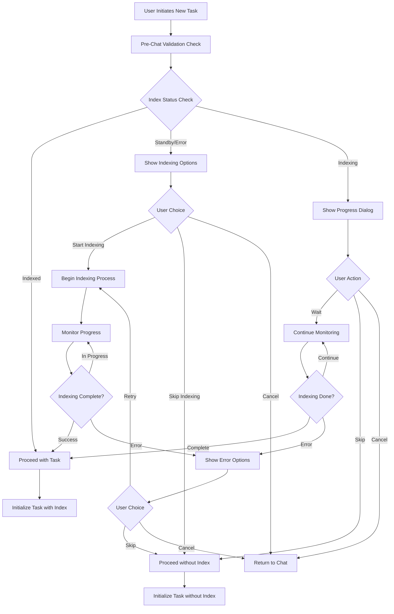
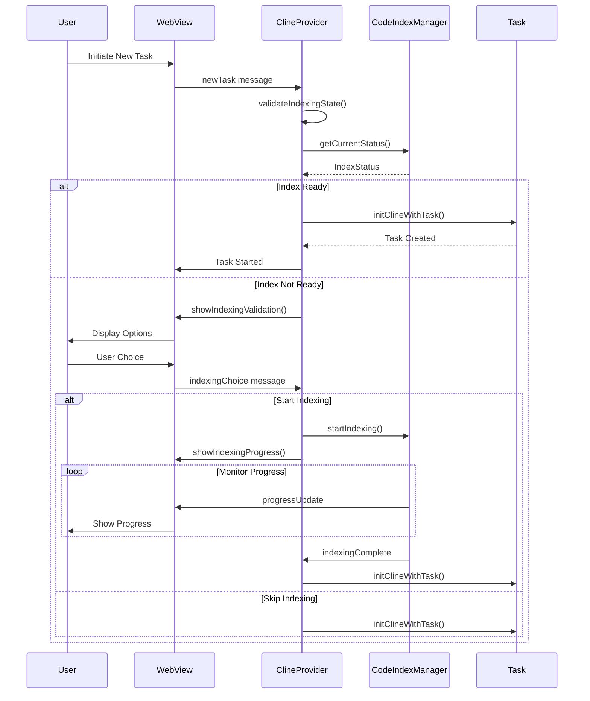

# Pre-Chat Indexing Validation Architecture Specification

## Executive Summary

This document specifies the architecture for integrating pre-chat indexing validation into the existing Blues Code extension system. The solution leverages the existing robust indexing infrastructure (CodeIndexManager, CodeIndexOrchestrator) while adding a validation layer before task initialization to ensure optimal codebase search capabilities.

## Current System Analysis

### Existing Infrastructure

- **CodeIndexManager**: Singleton pattern with workspace-specific instances
- **CodeIndexOrchestrator**: Coordinates indexing workflow with states: "Standby" | "Indexing" | "Indexed" | "Error"
- **Task System**: Core agent management in `src/core/task/Task.ts`
- **ClineProvider**: Main controller in `src/core/webview/ClineProvider.ts`
- **WebView Integration**: Message handling for UI communication

### Key Integration Points Identified

1. `Task.startTask()` method (lines 956-981) - where agent initialization happens
2. `ClineProvider.initClineWithTask()` - task creation entry point
3. WebView message handling for "newTask" messages (lines 301-306)
4. `CodeIndexManager.getCurrentStatus()` - provides indexing state information

## 1. Pre-Chat Validation Flow Architecture

### 1.1 High-Level Flow Diagram



### 1.2 Validation Sequence Diagram



## 2. Technical Requirements Specification

### 2.1 New Methods in Existing Classes

#### 2.1.1 ClineProvider Extensions

```typescript
// New methods to add to ClineProvider class
class ClineProvider {
	/**
	 * Validates indexing state before task initialization
	 * @returns Promise<IndexValidationResult>
	 */
	private async validateIndexingState(): Promise<IndexValidationResult>

	/**
	 * Enhanced task initialization with indexing validation
	 * @param text - Task text
	 * @param images - Task images
	 * @param parentTask - Parent task if subtask
	 * @param options - Task options
	 * @param skipIndexValidation - Skip validation for subtasks/retries
	 */
	public async initClineWithTaskValidated(
		text?: string,
		images?: string[],
		parentTask?: Task,
		options?: Partial<TaskOptions>,
		skipIndexValidation?: boolean,
	): Promise<Task>

	/**
	 * Handles user choice from indexing validation dialog
	 * @param choice - User's indexing choice
	 * @param taskData - Pending task data
	 */
	private async handleIndexingChoice(choice: IndexingChoice, taskData: PendingTaskData): Promise<void>
}
```

#### 2.1.2 CodeIndexManager Extensions

```typescript
// New methods to add to CodeIndexManager class
class CodeIndexManager {
	/**
	 * Checks if indexing is recommended for the current workspace
	 * @returns Promise<IndexRecommendation>
	 */
	public async getIndexingRecommendation(): Promise<IndexRecommendation>

	/**
	 * Estimates indexing time based on workspace size
	 * @returns Promise<IndexingEstimate>
	 */
	public async estimateIndexingTime(): Promise<IndexingEstimate>

	/**
	 * Validates current index health and completeness
	 * @returns Promise<IndexHealthStatus>
	 */
	public async validateIndexHealth(): Promise<IndexHealthStatus>
}
```

#### 2.1.3 Task Class Extensions

```typescript
// New method to add to Task class
class Task {
	/**
	 * Enhanced startTask with indexing context
	 * @param task - Task text
	 * @param images - Task images
	 * @param indexingContext - Indexing validation context
	 */
	private async startTaskWithIndexing(
		task?: string,
		images?: string[],
		indexingContext?: IndexingContext,
	): Promise<void>
}
```

### 2.2 New Type Definitions

```typescript
interface IndexValidationResult {
	isValid: boolean
	status: IndexingStatus
	recommendation: IndexRecommendation
	estimate?: IndexingEstimate
	error?: string
}

interface IndexRecommendation {
	shouldIndex: boolean
	reason: string
	priority: "high" | "medium" | "low"
	workspaceSize: number
	fileCount: number
}

interface IndexingEstimate {
	estimatedTimeMs: number
	estimatedFiles: number
	confidence: number
}

interface IndexHealthStatus {
	isHealthy: boolean
	completeness: number
	lastIndexed?: Date
	issues?: string[]
}

interface PendingTaskData {
	text?: string
	images?: string[]
	parentTask?: Task
	options?: Partial<TaskOptions>
	timestamp: number
}

type IndexingChoice = "start" | "skip" | "cancel" | "wait"

interface IndexingContext {
	hasIndex: boolean
	indexQuality: number
	userChoice: IndexingChoice
	validationTimestamp: number
}
```

### 2.3 WebView Message Protocol Extensions

```typescript
// New WebView message types
interface IndexingValidationMessage {
	type: "showIndexingValidation"
	validation: IndexValidationResult
	taskId: string
}

interface IndexingChoiceMessage {
	type: "indexingChoice"
	choice: IndexingChoice
	taskId: string
}

interface IndexingProgressMessage {
	type: "indexingProgress"
	progress: IndexProgressUpdate
	canSkip: boolean
	canCancel: boolean
}

interface IndexingCompleteMessage {
	type: "indexingComplete"
	success: boolean
	taskId: string
	error?: string
}
```

## 3. Implementation Strategy

### 3.1 Phase 1: Core Validation Infrastructure (Week 1-2)

**Objective**: Implement basic validation without UI changes

**Tasks**:

1. Add `validateIndexingState()` method to ClineProvider
2. Extend CodeIndexManager with recommendation methods
3. Create new type definitions
4. Add indexing context to Task initialization
5. Implement basic validation logic
6. Add comprehensive unit tests

**Deliverables**:

- Core validation methods implemented
- Type definitions added
- Unit tests with >90% coverage
- Integration tests for validation flow

### 3.2 Phase 2: WebView Integration (Week 3)

**Objective**: Add UI components for indexing validation

**Tasks**:

1. Extend WebView message protocol
2. Create indexing validation dialog component
3. Add progress monitoring UI
4. Implement user choice handling
5. Add error state management
6. Update message handler in webviewMessageHandler.ts

**Deliverables**:

- WebView components for validation flow
- Message protocol extensions
- User interaction handling
- Error state management

### 3.3 Phase 3: Enhanced User Experience (Week 4)

**Objective**: Polish UX and add advanced features

**Tasks**:

1. Add indexing time estimation
2. Implement smart recommendations
3. Add configuration options
4. Enhance progress reporting
5. Add accessibility features
6. Implement user preferences persistence

**Deliverables**:

- Enhanced UX with smart recommendations
- Configuration options
- Accessibility compliance
- User preference persistence

### 3.4 Phase 4: Testing and Optimization (Week 5)

**Objective**: Comprehensive testing and performance optimization

**Tasks**:

1. End-to-end testing scenarios
2. Performance optimization
3. Error handling edge cases
4. Documentation updates
5. Beta testing with internal users
6. Performance benchmarking

**Deliverables**:

- Complete test suite
- Performance benchmarks
- Documentation updates
- Beta testing results

## 4. User Experience Design

### 4.1 Indexing Validation Dialog

```
┌─────────────────────────────────────────────────────────┐
│ 🔍 Codebase Indexing Validation                        │
├─────────────────────────────────────────────────────────┤
│                                                         │
│ Your workspace isn't indexed yet. Indexing enables     │
│ powerful codebase search capabilities for better AI    │
│ assistance.                                             │
│                                                         │
│ Workspace: ~/my-project (1,247 files)                  │
│ Estimated time: ~2 minutes                             │
│                                                         │
│ ┌─────────────────────────────────────────────────────┐ │
│ │ ⚡ Start Indexing (Recommended)                     │ │
│ │   Enable full codebase search capabilities         │ │
│ └─────────────────────────────────────────────────────┘ │
│                                                         │
│ ┌─────────────────────────────────────────────────────┐ │
│ │ ⏭️  Skip for Now                                    │ │
│ │   Continue without codebase search                 │ │
│ └─────────────────────────────────────────────────────┘ │
│                                                         │
│ ┌─────────────────────────────────────────────────────┐ │
│ │ ❌ Cancel                                           │ │
│ └─────────────────────────────────────────────────────┘ │
│                                                         │
│ ☑️ Don't ask again for this workspace                   │
└─────────────────────────────────────────────────────────┘
```

### 4.2 Progress Monitoring Dialog

```
┌─────────────────────────────────────────────────────────┐
│ 🔄 Indexing in Progress                                 │
├─────────────────────────────────────────────────────────┤
│                                                         │
│ Processing your codebase for optimal AI assistance...  │
│                                                         │
│ ████████████████████░░░░ 80% (1,000/1,247 files)      │
│                                                         │
│ Current: src/components/UserInterface.tsx              │
│ Elapsed: 1m 32s | Remaining: ~28s                      │
│                                                         │
│ ┌─────────────────────────────────────────────────────┐ │
│ │ ⏭️  Skip and Continue                               │ │
│ └─────────────────────────────────────────────────────┘ │
│                                                         │
│ ┌─────────────────────────────────────────────────────┐ │
│ │ ❌ Cancel Task                                       │ │
│ └─────────────────────────────────────────────────────┘ │
└─────────────────────────────────────────────────────────┘
```

### 4.3 User Flow States

#### 4.3.1 First-Time User Flow

1. User initiates new task
2. System detects no index exists
3. Show indexing validation dialog with recommendation
4. User chooses to start indexing
5. Show progress dialog with skip option
6. Indexing completes successfully
7. Task starts with full codebase search enabled

#### 4.3.2 Returning User Flow

1. User initiates new task
2. System detects existing index
3. Validate index health and completeness
4. If healthy: proceed directly to task
5. If stale/incomplete: show update recommendation

#### 4.3.3 Error Recovery Flow

1. Indexing fails during process
2. Show error dialog with options:
    - Retry indexing
    - Skip and continue
    - Cancel task
3. If retry: restart indexing process
4. If skip: continue without index
5. If cancel: return to chat interface

## 5. Edge Cases and Error Handling

### 5.1 Large Workspace Handling

**Challenge**: Workspaces with >10,000 files may take significant time to index

**Solution**:

- Implement progressive indexing with priority files first
- Show detailed progress with file-level granularity
- Allow users to cancel and resume indexing
- Provide workspace size warnings before starting

**Implementation**:

```typescript
interface ProgressiveIndexingConfig {
	priorityPatterns: string[] // e.g., ['*.ts', '*.js', '*.py']
	batchSize: number // Files per batch
	pauseBetweenBatches: number // Ms to pause between batches
	maxConcurrentFiles: number // Parallel processing limit
}
```

### 5.2 Network Connectivity Issues

**Challenge**: Indexing may require network access for embeddings

**Solution**:

- Detect network connectivity before starting
- Implement retry logic with exponential backoff
- Provide offline mode with local embeddings
- Cache embeddings for offline use

**Implementation**:

```typescript
interface NetworkAwareIndexing {
	checkConnectivity(): Promise<boolean>
	enableOfflineMode(): void
	retryWithBackoff(attempt: number): Promise<void>
}
```

### 5.3 Configuration Errors

**Challenge**: Invalid embedder configuration may prevent indexing

**Solution**:

- Validate configuration before showing indexing options
- Provide configuration repair suggestions
- Allow users to fix configuration inline
- Fallback to default configuration if possible

### 5.4 Partial Indexing Scenarios

**Challenge**: Indexing may be interrupted or partially complete

**Solution**:

- Implement resumable indexing with checkpoint system
- Track indexed files in persistent storage
- Validate partial index completeness
- Allow users to resume from last checkpoint

**Implementation**:

```typescript
interface IndexingCheckpoint {
	workspaceId: string
	lastIndexedFile: string
	completedFiles: string[]
	timestamp: Date
	totalFiles: number
}

class ResumableIndexing {
	saveCheckpoint(checkpoint: IndexingCheckpoint): Promise<void>
	loadCheckpoint(workspaceId: string): Promise<IndexingCheckpoint | null>
	resumeFromCheckpoint(checkpoint: IndexingCheckpoint): Promise<void>
}
```

### 5.5 Memory and Performance Constraints

**Challenge**: Large workspaces may exceed memory limits during indexing

**Solution**:

- Implement streaming indexing with memory management
- Use worker threads for CPU-intensive operations
- Implement garbage collection between batches
- Monitor memory usage and adjust batch sizes

**Implementation**:

```typescript
interface MemoryAwareIndexing {
	maxMemoryUsage: number
	currentMemoryUsage: number
	adjustBatchSize(): void
	triggerGarbageCollection(): void
}
```

## 6. Backward Compatibility Considerations

### 6.1 Existing Task Flow Preservation

**Requirement**: Existing task initialization must continue to work without changes

**Implementation Strategy**:

- Add validation as optional layer in existing flow
- Maintain existing `initClineWithTask()` method signature
- Add new `initClineWithTaskValidated()` method for enhanced flow
- Use feature flags to gradually roll out validation

**Code Changes**:

```typescript
// Existing method remains unchanged
public async initClineWithTask(
    text?: string,
    images?: string[],
    parentTask?: Task,
    options?: Partial<TaskOptions>
): Promise<Task> {
    // Existing implementation unchanged
    return this.initClineWithTaskValidated(text, images, parentTask, options, true)
}

// New method with validation
public async initClineWithTaskValidated(
    text?: string,
    images?: string[],
    parentTask?: Task,
    options?: Partial<TaskOptions>,
    skipIndexValidation: boolean = false
): Promise<Task> {
    if (skipIndexValidation || this.isValidationDisabled()) {
        return this.originalInitClineWithTask(text, images, parentTask, options)
    }

    // New validation logic here
}
```

### 6.2 Configuration Backward Compatibility

**Requirement**: Existing user configurations must remain valid

**Implementation**:

- Add new configuration options with sensible defaults
- Maintain existing configuration structure
- Provide migration path for deprecated options

**Configuration Schema**:

```typescript
interface IndexingValidationConfig {
	enabled: boolean // Default: true
	autoStartForSmallWorkspaces: boolean // Default: true
	maxAutoIndexFiles: number // Default: 1000
	showProgressDialog: boolean // Default: true
	rememberUserChoice: boolean // Default: true
	validationTimeout: number // Default: 5000ms
}
```

### 6.3 API Compatibility

**Requirement**: External integrations and extensions must continue to work

**Implementation**:

- Maintain existing public API surface
- Add new APIs as optional extensions
- Use semantic versioning for breaking changes
- Provide deprecation warnings for removed features

## 7. Performance Impact Mitigation

### 7.1 Validation Performance

**Target**: Validation check should complete within 100ms

**Optimization Strategies**:

- Cache indexing status in memory
- Use lazy loading for detailed recommendations
- Implement background status updates
- Minimize file system operations

**Implementation**:

```typescript
class PerformantValidation {
	private statusCache = new Map<string, CachedIndexStatus>()
	private readonly CACHE_TTL = 30000 // 30 seconds

	async getIndexStatus(workspaceId: string): Promise<IndexStatus> {
		const cached = this.statusCache.get(workspaceId)
		if (cached && Date.now() - cached.timestamp < this.CACHE_TTL) {
			return cached.status
		}

		const status = await this.fetchIndexStatus(workspaceId)
		this.statusCache.set(workspaceId, {
			status,
			timestamp: Date.now(),
		})

		return status
	}
}
```

### 7.2 UI Responsiveness

**Target**: UI should remain responsive during validation and indexing

**Strategies**:

- Use Web Workers for heavy computations
- Implement progressive loading for large file lists
- Use virtual scrolling for progress displays
- Debounce user interactions

### 7.3 Memory Usage Optimization

**Target**: Validation should use <50MB additional memory

**Strategies**:

- Stream file processing instead of loading all at once
- Use weak references for cached data
- Implement automatic cache cleanup
- Monitor memory usage with telemetry

## 8. Security Considerations

### 8.1 File Access Security

**Requirement**: Validation must respect existing file access permissions

**Implementation**:

- Use existing file access patterns from CodeIndexManager
- Respect `.gitignore` and other exclusion patterns
- Validate file paths to prevent directory traversal
- Log security-relevant operations

### 8.2 User Data Privacy

**Requirement**: No sensitive data should be exposed in validation process

**Implementation**:

- Avoid logging file contents or paths in production
- Use hashed identifiers for telemetry
- Respect user privacy settings
- Implement data retention policies

## 9. Testing Strategy

### 9.1 Unit Testing Requirements

**Coverage Target**: >95% code coverage for validation logic

**Test Categories**:

- Validation logic with various index states
- Error handling and recovery scenarios
- Configuration option combinations
- Performance benchmarks

**Key Test Cases**:

```typescript
describe("IndexingValidation", () => {
	test("should recommend indexing for large unindexed workspace")
	test("should skip validation for already indexed workspace")
	test("should handle indexing errors gracefully")
	test("should respect user choice persistence")
	test("should validate within performance targets")
})
```

### 9.2 Integration Testing

**Scope**: End-to-end validation flow with real workspaces

**Test Scenarios**:

- First-time user with various workspace sizes
- Returning user with stale index
- Network connectivity issues during indexing
- Memory constraints with large workspaces
- Concurrent task initialization attempts

### 9.3 Performance Testing

**Benchmarks**:

- Validation latency: <100ms for 95th percentile
- Memory usage: <50MB additional during validation
- UI responsiveness: No blocking operations >16ms
- Indexing throughput: >100 files/second

## 10. Monitoring and Telemetry

### 10.1 Key Metrics

**User Experience Metrics**:

- Validation completion rate
- User choice distribution (start/skip/cancel)
- Time to task initialization
- Indexing success rate

**Performance Metrics**:

- Validation latency percentiles
- Memory usage during validation
- Indexing throughput by workspace size
- Error rates by error type

**Implementation**:

```typescript
interface ValidationTelemetry {
	trackValidationStart(workspaceSize: number): void
	trackValidationComplete(duration: number, choice: IndexingChoice): void
	trackIndexingProgress(filesProcessed: number, totalFiles: number): void
	trackError(error: ValidationError, context: ErrorContext): void
}
```

### 10.2 Error Tracking

**Error Categories**:

- Configuration errors
- File system access errors
- Network connectivity issues
- Memory/performance constraints
- User cancellation scenarios

## 11. Documentation Requirements

### 11.1 User Documentation

**Required Documents**:

- Feature overview and benefits
- Configuration options guide
- Troubleshooting common issues
- Performance optimization tips

### 11.2 Developer Documentation

**Required Documents**:

- API reference for new methods
- Integration guide for extensions
- Architecture decision records
- Performance tuning guide

### 11.3 Migration Guide

**Content Requirements**:

- Breaking changes (if any)
- New configuration options
- Behavioral changes
- Upgrade recommendations

## 12. Rollout Strategy

### 12.1 Feature Flag Implementation

**Flags Required**:

- `enableIndexingValidation`: Master toggle
- `autoStartSmallWorkspaces`: Auto-start for <1000 files
- `showDetailedProgress`: Enhanced progress UI
- `enablePerformanceOptimizations`: Advanced optimizations

### 12.2 Gradual Rollout Plan

**Phase 1 (10% users)**: Basic validation with manual opt-in
**Phase 2 (25% users)**: Default enabled with easy opt-out
**Phase 3 (50% users)**: Full feature set with optimizations
**Phase 4 (100% users)**: Complete rollout with monitoring

### 12.3 Rollback Strategy

**Rollback Triggers**:

- Error rate >5%
- Performance degradation >20%
- User satisfaction drop >10%
- Critical bugs affecting core functionality

**Rollback Process**:

1. Disable feature flags immediately
2. Revert to previous task initialization flow
3. Investigate and fix issues
4. Re-enable with fixes

## 13. Success Criteria

### 13.1 Functional Success Criteria

- ✅ Validation completes successfully for 95% of workspaces
- ✅ User can choose indexing options in <3 clicks
- ✅ Indexing progress is clearly communicated
- ✅ Error scenarios are handled gracefully
- ✅ Existing functionality remains unaffected

### 13.2 Performance Success Criteria

- ✅ Validation latency <100ms (95th percentile)
- ✅ Memory overhead <50MB during validation
- ✅ UI remains responsive throughout process
- ✅ No impact on existing task initialization speed

### 13.3 User Experience Success Criteria

- ✅ User satisfaction score >4.0/5.0
- ✅ Feature adoption rate >60% within 30 days
- ✅ Support ticket volume increase <5%
- ✅ User retention remains stable or improves

## 14. Implementation Checklist

### 14.1 Phase 1: Core Infrastructure

- [ ] Add `validateIndexingState()` method to ClineProvider
- [ ] Extend CodeIndexManager with recommendation methods
- [ ] Create new TypeScript type definitions
- [ ] Add indexing context to Task initialization
- [ ] Implement basic validation logic
- [ ] Add comprehensive unit tests (>95% coverage)
- [ ] Create integration tests for validation flow
- [ ] Add performance benchmarks

### 14.2 Phase 2: WebView Integration

- [ ] Extend WebView message protocol
- [ ] Create indexing validation dialog component
- [ ] Add progress monitoring UI components
- [ ] Implement user choice handling logic
- [ ] Add error state management
- [ ] Update webviewMessageHandler.ts
- [ ] Add accessibility features
- [ ] Test cross-platform compatibility

### 14.3 Phase 3: Enhanced Features

- [ ] Add indexing time estimation
- [ ] Implement smart recommendations
- [ ] Add configuration options
- [ ] Enhance progress reporting with file-level details
- [ ] Implement user preferences persistence
- [ ] Add telemetry and monitoring
- [ ] Create user documentation
- [ ] Add developer API documentation

### 14.4 Phase 4: Testing and Optimization

- [ ] Complete end-to-end testing scenarios
- [ ] Performance optimization and benchmarking
- [ ] Edge case testing and error handling
- [ ] Security review and validation
- [ ] Beta testing with internal users
- [ ] Documentation review and updates
- [ ] Rollout strategy implementation
- [ ] Monitoring dashboard setup

---

## Conclusion

This architectural specification provides a comprehensive blueprint for integrating pre-chat indexing validation into the Blues Code extension system. The design leverages existing infrastructure while adding minimal complexity, ensuring a smooth user experience and maintaining backward compatibility.

The phased implementation approach allows for iterative development and testing, reducing risk while delivering value incrementally. The focus on performance, user experience, and robust error handling ensures the feature will enhance rather than hinder the existing workflow.

Key success factors:

1. **Minimal Disruption**: Builds on existing infrastructure
2. **User-Centric Design**: Clear options and progress communication
3. **Performance Focused**: Sub-100ms validation with efficient resource usage
4. **Robust Error Handling**: Graceful degradation in all scenarios
5. **Comprehensive Testing**: >95% coverage with real-world scenarios

The implementation team can use this specification as a detailed roadmap, with each phase building upon the previous while maintaining system stability and user satisfaction.
