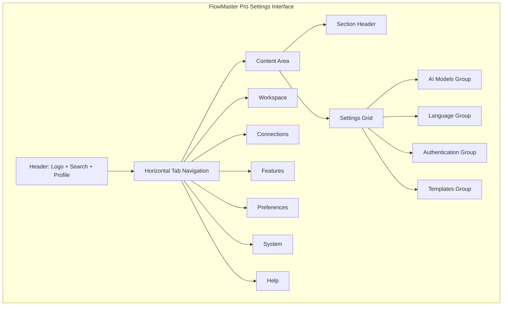
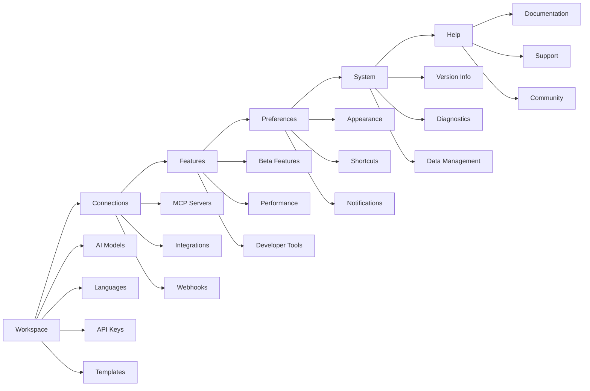
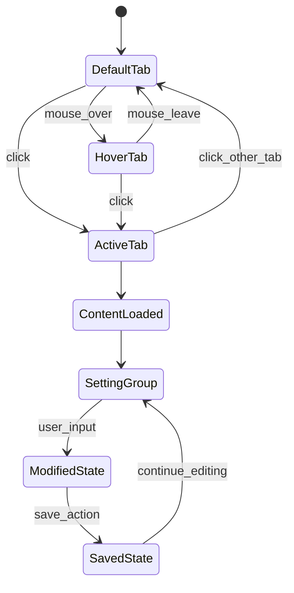
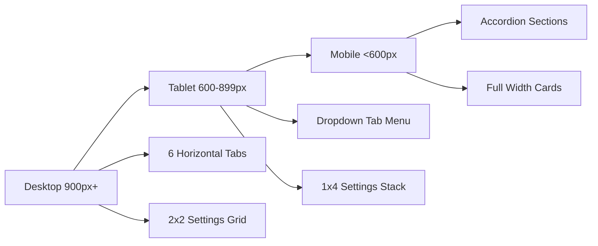

# FlowMaster Pro Settings UI Wireframes

## Main Interface Layout (900x600)



## Tab Navigation Flow



## Visual Hierarchy Wireframe

### Desktop Layout (900x600px)

```
┌─────────────────────────────────────────────────────────┐
│  🔄 FlowMaster Pro        [🔍 Search]    [👤 Profile]   │
├─────────────────────────────────────────────────────────┤
│                                                         │
│  [Workspace] [Connections] [Features] [Preferences] [System] [Help] │
│  ═══════════                                            │
│                                                         │
│  Workspace Configuration                    🔍 Search   │
│  ─────────────────────────                              │
│                                                         │
│  ┌─────────────────┐  ┌─────────────────┐              │
│  │   AI Models     │  │   Languages     │              │
│  │                 │  │                 │              │
│  │ ○ GPT-4         │  │ 🌐 English (en) │              │
│  │ ○ Claude-3      │  │ 🌐 Spanish (es) │              │
│  │ ○ Gemini Pro    │  │ 🌐 French (fr)  │              │
│  │                 │  │                 │              │
│  │ [Configure]     │  │ [Change Lang]   │              │
│  └─────────────────┘  └─────────────────┘              │
│                                                         │
│  ┌─────────────────┐  ┌─────────────────┐              │
│  │ Authentication  │  │   Templates     │              │
│  │                 │  │                 │              │
│  │ 🔑 API Keys     │  │ 📄 React App    │              │
│  │ 🔐 OAuth Setup  │  │ 📄 Node.js API  │              │
│  │ 🛡️ Security     │  │ 📄 Python ML    │              │
│  │                 │  │                 │              │
│  │ [Manage Keys]   │  │ [Create New]    │              │
│  └─────────────────┘  └─────────────────┘              │
│                                                         │
└─────────────────────────────────────────────────────────┘
```

### Tablet Layout (600-899px)

```
┌─────────────────────────────────────────┐
│  🔄 FlowMaster Pro    [≡] [👤]          │
├─────────────────────────────────────────┤
│                                         │
│  [Workspace ▼] [🔍]                     │
│                                         │
│  ┌─────────────────┐                    │
│  │   AI Models     │                    │
│  │                 │                    │
│  │ ○ GPT-4         │                    │
│  │ ○ Claude-3      │                    │
│  │                 │                    │
│  └─────────────────┘                    │
│                                         │
│  ┌─────────────────┐                    │
│  │   Languages     │                    │
│  │                 │                    │
│  │ 🌐 English (en) │                    │
│  │ 🌐 Spanish (es) │                    │
│  │                 │                    │
│  └─────────────────┘                    │
│                                         │
└─────────────────────────────────────────┘
```

## Component State Variations



## Setting Group Card Design

### Standard Card Layout

```
┌─────────────────────────────────┐
│  🎯 Group Title                 │
│  ─────────────────────────       │
│                                 │
│  Setting Label 1                │
│  [Input Field        ] [?]     │
│                                 │
│  Setting Label 2                │
│  ○ Option A  ○ Option B         │
│                                 │
│  Setting Label 3                │
│  [Toggle Switch]    ✓ Enabled   │
│                                 │
│  ┌─────────┐ ┌─────────┐        │
│  │  Save   │ │ Reset   │        │
│  └─────────┘ └─────────┘        │
└─────────────────────────────────┘
```

## Color and Visual States

### Tab States

- **Default**: Warm white background, medium brown text
- **Hover**: Light orange background (#F39C12 10% opacity)
- **Active**: Warm orange underline, cream background
- **Focus**: Orange outline for accessibility

### Card States

- **Default**: Warm white with cream border
- **Hover**: Subtle elevation with warm shadow
- **Modified**: Orange accent border to indicate changes
- **Error**: Soft coral border for validation errors

## Responsive Behavior

### Breakpoint Transitions



## Accessibility Features

### Keyboard Navigation

- Tab key cycles through horizontal tabs
- Arrow keys navigate within tab content
- Enter/Space activates controls
- Escape closes dropdowns/modals

### Screen Reader Support

- Semantic HTML structure
- ARIA labels for all interactive elements
- Role definitions for custom components
- Live regions for dynamic content updates

### Visual Accessibility

- High contrast mode with enhanced color differences
- Focus indicators with 3:1 contrast ratio
- Text scaling support up to 200%
- Color-blind friendly warm palette

## Animation Specifications

### Tab Transitions

- Duration: 200ms ease-in-out
- Orange underline slides to new position
- Content fades out/in with 150ms delay
- No animation on initial load

### Hover Effects

- Background color: 100ms linear transition
- Card elevation: 200ms ease-out
- Button states: 150ms ease-in-out

### Loading States

- Skeleton placeholders with warm gray shimmer
- Progressive loading for heavy sections
- Smooth fade-in when content ready

This wireframe specification provides a complete visual guide for implementing the FlowMaster Pro settings interface with warm, productivity-focused design elements.
